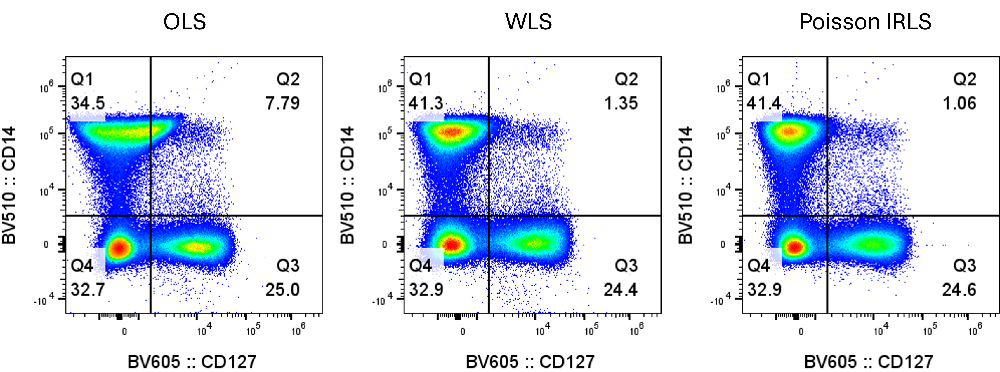

<!-- README.md is generated from README.Rmd. Please edit that file -->

# AutoSpectralRcpp

<!-- badges: start -->

<!-- badges: end -->

AutoSpectralRcpp provides a wrapper around a fast C++ function for
performing spectral unmixing of flow cytometry data using the
Poisson-Hybrid approach. This minimizes unmixing-dependent spread and
spillover spread, producing better resolution in most cases than OLS or
WLS unmixing.


This work has received funding from the KU Leuven C1 program, the
European Union’s Horizon 2020 research and innovation programme under
grant agreement No 874707 (EXIMIOUS), Wellcome Investigator Award,
222442/A/21/Z and UKRI Proactive Vaccinology Award, MR/Y004450/1
(IMMPROVE).

## Installation

Recommended, but not essential: first install AutoSpectral:

``` r
devtools::install_github("DrCytometer/AutoSpectral")
```

The AutoSpectralRcpp package optionally uses OpenMP for parallel
processing. This is, unfortunately, quite difficult to set up on Mac. It
should work automatically on Windows. To enable it, define PKG_CXXFLAGS
= -fopenmp in a personal ~/.R/Makevars file (Linux/macOS). You may need
the following:

CXX_STD = CXX17 PKG_CXXFLAGS = -fopenmp PKG_LIBS = -fopenmp
\$(LAPACK_LIBS) \$(BLAS_LIBS) \$(FLIBS)

You can install the development version of AutoSpectralRcpp like so:

``` r
devtools::install_github("DrCytometer/AutoSpectralRcpp")
```

## Example

Use the R wrapper function to unmix your data.

Raw data should be in the format of cells (rows) by detectors (columns),
using only the fluorescence detectors.

Spectra should be in the format of fluorophores (rows) by detectors
(columns). Detectors must match raw data. Fluorophore names should be
set as the rownames of spectra and should not appear in the matrix.

``` r
library( AutoSpectralRcpp )
poisson.unmixed <- unmix.poisson.fast( raw.spectral.data, panel.spectra )
```

Spectra for unmixing can be generated using AutoSpectral, or extracted
from other flow cytometry tools (e.g., FlowJo, FCSExpress).
